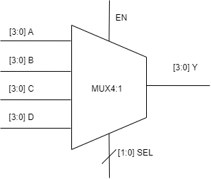

# Functional Block description

The main objective for a mux block is to create a route for a given input signal to output controled by a selection input signal. Figure 1 shows the representation of a mux implementation used is in this verification plan.

    <figure>
    
    <figcaption>Figure 1 - Mux 4:1 representation.</figcaption>
    </figure>

[Back to Main](readme.md)